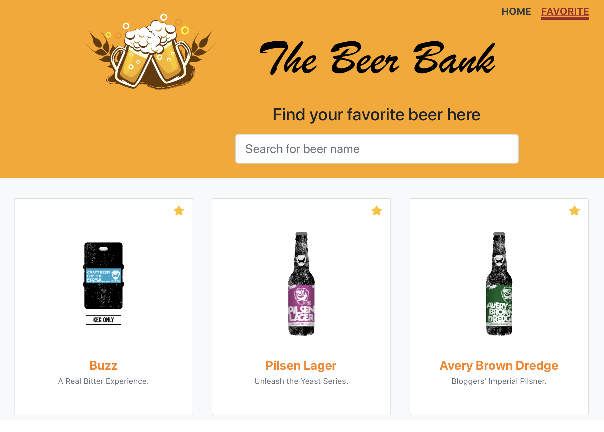
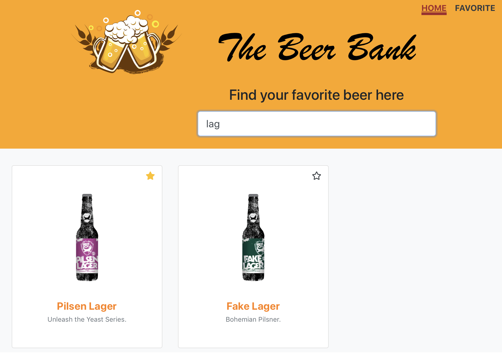

# Beer-bank Project
- This is a beer bank app, built with ReactJS, React-Bootstrap and Bootstrap 4.3. 

## App Functionality
Users will be able to 
- search for beer with beer name
- check detailed info of a beer
- get suggestions with similar type of beers 
- add beer to favorite

## Project Screenshots
### HomePage

### FavoritePage

### BeerInfo

### Search beers

### Installation Instructions
* clone my repo `https://github.com/mavisluan/beer-bank.git`
* install all project dependencies with `yarn install`
* start the development server with `yarn start`

